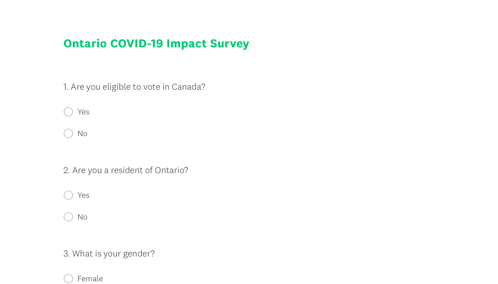

```{r setup, include=FALSE}
knitr::opts_chunk$set(collapse = TRUE)
#Load Data

# load cesR package and labelled package
library(labelled)
library(dplyr)
library(ggplot2)
library(readxl)

# Read in Ontario Census Data
OntarioCensus <- read_excel("./OntarioCensus.xlsx")
names(OntarioCensus) <- c("Columns", "Age", "Male", "Female", "NA")

```

# Excecutive Summary
With COVID-19 rampages through Ontario, the PPC (Progressive Conservative Party) of Ontario, under the leadership of Premier Doug Ford, achieved initial success in containing the spread of the virus, and along with it, Ford’s support rate has increased. The survey used in the report is designed to analyze the impact of the pandemic and its relations with the approval rate of Premier Doug Ford and his party.

Our survey, in total of 12 questions, gives us an overview of COVID-19 impact, government performance rating, and voting intentions. The survey starts with socio-demographic questions(like gender and age) to ensure all segments of the Ontario population are properly represented. We have ensured to arrange the questions in a specific order so that the previous question has minimal impact on respondents' answers. Then it is administered using simple random sampling without replacement(SRSWOR) through dialing random Ontario residents. The survey result was then simulated by datasets from recently conducted polls online. The findings have demonstrated the percentage of residents impacted by the pandemic from each perspective. The general satisfaction with the Ford government’s response to the pandemic is around 74%.  Though the majority of the respondents indicated that there have been no changes in their work, financial situation, and mental health, it is extremely concerning that about 34% of the respondents have experienced a negative impact on their mental health. The result above indicates that more resources are mandatory to help Ontario residents experiencing mental health difficulties. Several significant findings come from respondents’ voting intentions. 46.5% of respondents would vote for the Conservative Party if a provincial election is being held today, which is a 7.3% increase from the 2018 election. Moreover,  24% of decided voters have changed their political stands based on the government's response to COVID.  Such findings suggest that a key to gain popularity from Ontarians is through taking proper action of the pandemic. As the Progressive Conservative Party of Ontario passes the halfway mark of its political term, the rising approval rate elevates the party’s electoral fortune in the 2020 election. 

We have taken a quantitative approach by surveying a large sample of randomly selected respondents. The main shortcoming of quantitative methods is that the interpretation is not discussed thus left to the respondent’s discretion. Our survey only focuses on preconceived issues(eg. Public health response, work, finance, mental health, vote intentions), as a result, some other concerns may be overlooked. Our quantitative data is simulated by the related secondary data available online, such as Ontario census data, government statistics, and independent research. It is confirmed that the data used is consistent, precise, and reputable. That being said, our research is limited to the data published, leaving our data vulnerable to slight inaccuracy without the knowledge of the survey methodology behind the secondary data. More specifics of the weakness will be demonstrated below. Future studies can be conducted by distributing the survey to desired respondents with more detailed questions aiming to help residents of Ontario improve their situation under COVID impact. 


\newpage
# Introduction
COVID-19 pandemic has impacted Ontario in various aspects. Almost everyone has experienced a drastic change in their way of life due to the pandemic. Some of the changes, positive or negative, have had an important impact on their political orientation. In this report, we designed and analyzed the survey “Ontario COVID-19 impact”, intending to discover the influence of COVID-19 on Ontario resident’s political stance and voting intentions. 

Upon deciding our survey methodology, we have taken cost, efficiency, responses, and bias into consideration. More of our methodology will be discussed below. Consequently, the survey consists of socio-demographic, COVID impacts, political stance, and voting intentions, in which we then distributed through phone calls by simple random sampling without replacement (details of the survey attached to appendix). Such probability sampling technique provides a projectible result, and it allows us to apply statistical procedures to analyze data and calculate errors. 

The data is simulated using R (Link to code: https://github.com/1234567980/STA302-PS2).Our findings have revealed that only 53% of respondents consider the public health response “appropriate”, whereas 29% think it is insufficient. We have also discovered the COVID-19 pandemic’s impact on different aspects of Ontario residents. In general, the majority of the population is not heavily impacted. However, a significant proportion are undergoing negative impacts from the pandemic in certain aspects such as mental health and financial situation. Despite 77% of the population being satisfied with the Ontario government’s response, there is still a lot to be done in order to meet the residents’ needs. It is important to take action on such issues as we have discovered 21% of decided voter’s voting intention is influenced by the pandemic. Thus, the electoral fortune of the Progressive Conservative Party in 2022 is broadly influenced by people’s satisfaction with their response. 

Our findings have some potential weaknesses and limitations that will later be discussed in detail, as well as some achievable future studies. 


\newpage
# Methodology/Sampling method
The survey respondents were chosen using a simple random sample without replacement method. Some statistical properties that using this method brings is that the means obtained from our sample population can be interpreted as unbiased estimators of the population mean. As mentioned by Thompson and Wu in ‘Sampling Theory and Practice’(23. “Wu”) the sample mean and variance are design-unbiased estimators for the population mean and variance. Thus by using SRSWOR we can assume in the discussion that the analysis obtained from the survey results is applicable for the population.  Our sampling frame is Ontario residents aged 18 years and above as our main focus is past and future voters. Petit Poll selects a random digits sample of both land lines and phone numbers start with Ontario area code. With around 80% of cellphone numbers and 20% of land lines.The approach of using both land line and cellphone numbers ensures we have representatives of adults who have either access. We would randomly generate the last four digits of numbers, ensuring that our sample covers both listed and unlisted numbers. The sample is designed to be completely random, each with equal probability 1/N (N = the current population of Ontario = 14,745,040) representing all populations of Ontario. If the number is checked being in use, we would then list it into our sample size before dialing, ensuring that the numbers generated do not repeat. After we have completed our desired amount of 7700 numbers, we would start the interviewing process.

In our approach, we have referenced the interview method of land lines from PewReseach(15. “NW, 1615...”). In their approach of interviewing household through land lines, they would “randomly ask half the sample if they could speak with “the youngest male, 18 years of age or older, who is now at home” and the other half of the sample to speak with “the youngest female, 18 years of age or older, who is now at home.” If there is no eligible person of the requested gender currently at home, interviewers ask to speak with the youngest adult of the opposite gender, who is now at home.”(15. “NW, 1615...”). We have chosen to reference their method as it is a polished approach to improve the proportion of young people as they are less likely to answer and participate in surveys conducted by phone calls. 

In determining our sample size, we have chosen a confidence interval of 95%, with 5% margin of error. Using the formula 2.7 from ‘Sampling Theory and Practice’(23. “Wu”) to calculate the desired sample size, z-score as 1.96, standard deviation 0.5, and margin of errors 0.05, the sample size that we hope to achieve is n = 385 with random selection of 385 people out of the total population of Ontario (N =14,745,040). As we are only taking 0.002611% of the population, the finite population correction could be ignored. From the sample size above we have ensured that we would reach the desired level of accuracy.

We have developed a few methods to manage the non-respond. It is reported that the non-response rate of phone surveys is approximately 95% (7. Kennedy and Hartig). To reach 385 respondents, we have aimed to select 7700(385 x 20) Ontario residents for our survey. Secondly, at least 3 attempts are made to complete the interview with each sampled number on separate days. We have also planned our interview mainly in the evening of weekdays, and daytime of weekends, to maximize the chances of reaching potential respondents. In addition, we have minimized the length of our survey containing only 12 most relevant questions to our topic to further increase the completion rate, the interview will be no longer than 3 minutes including introduction and recording responses. 

To protect respondent's privacy, the phone numbers being interviewed will not be saved. Moreover, we avoid asking personal information such as name or social insurance number, collecting general non-sensitive information that will be used to weigh the sample. 


In our survey, we have included socio-demographic questions including gender and age to compensate for the bias created. We used gender and age in our sample to compare to the population parameters from Ontario census data from 2016(most recent census data available). Our sample is then weighted by matching the corresponding parameters.


From the information provided above, we have estimated the cost of the survey. Each interview takes up to three minutes, and 7700 phone calls are made with approximately 385 respondents. Assuming each unanswered phone call will take about one minute, and will be tried three times, it would take roughly 387 hours to complete our interview. Thus, hiring employees to direct the surveys at a pay rate of $20 an hour would cost approximately $7,740. Assuming that $7,740 is the monthly cost of providing polling updates to the Progressive Conservative Party of Ontario, the yearly cost would be $92,880. 


## Data Preview
Below is a preview of our simulated data: 


```{r, echo=FALSE}
# Rename columns and clean up data to only include data rows that we want
keeps <- c("Columns", "Age", "Male", "Female")
OntarioCensus <- OntarioCensus[keeps]
OntarioCensus <- OntarioCensus[-c(1:26), ]
OntarioCensus <- OntarioCensus[-c(3, 102:105), ]
OntarioCensus <- OntarioCensus[ c(1:7, 8, 14, 20,26,32,38,44,50,56),]
OntarioCensus <- rbind(c("18 to 24 years old",sum(sapply(OntarioCensus[1:7,2], as.numeric)), sum(sapply(OntarioCensus[1:7,3], as.numeric)), sum(sapply(OntarioCensus[1:7,4], as.numeric))), OntarioCensus)
OntarioCensus <- OntarioCensus[-c(2:8), ]

# Calculate the gender percents
total <- sum(sapply(OntarioCensus[1:10,2], as.numeric))
percent_male <- sum(sapply(OntarioCensus[1:10,3], as.numeric)) / total
percent_female <- sum(sapply(OntarioCensus[1:10,4], as.numeric)) / total

# Combine age ranges to suit the answers available in our data
OntarioCensus <- rbind(c("25 to 34 years old",sum(sapply(OntarioCensus[2:3,2], as.numeric)), sum(sapply(OntarioCensus[2:3,3], as.numeric)), sum(sapply(OntarioCensus[2:3,4], as.numeric))), OntarioCensus)
OntarioCensus <- OntarioCensus[-c(3:4), ]
OntarioCensus <- rbind(c("35 to 44 years old",sum(sapply(OntarioCensus[3:4,2], as.numeric)), sum(sapply(OntarioCensus[3:4,3], as.numeric)), sum(sapply(OntarioCensus[3:4,4], as.numeric))), OntarioCensus)
OntarioCensus <- OntarioCensus[-c(4:5), ]
OntarioCensus <- rbind(c("45 to 54 years old",sum(sapply(OntarioCensus[4:5,2], as.numeric)), sum(sapply(OntarioCensus[4:5,3], as.numeric)), sum(sapply(OntarioCensus[4:5,4], as.numeric))), OntarioCensus)
OntarioCensus <- OntarioCensus[-c(5:6), ]
OntarioCensus <- rbind(c("55 years and older",sum(sapply(OntarioCensus[5:7,2], as.numeric)), sum(sapply(OntarioCensus[5:7,3], as.numeric)), sum(sapply(OntarioCensus[5:7,4], as.numeric))), OntarioCensus)
OntarioCensus <- OntarioCensus[-c(6:8), ]

# Add new column for the percentage of each age range
OntarioCensus <- OntarioCensus %>% mutate(Percent = as.numeric(Age) / total)

# Probability weights for survery Q5
# PC, NDP, LIB, GRN
who2018_percentage <- c(0.4063, 0.3369, 0.193, 0.0462, 0.0176)

#TODO: Discuss later? Not sure how to find the appropriate amount of survey takers
survey_size <- 385

set.seed(123)

# Simulate random sampling from population with our survey (WITHOUT replacement)

my_data <- tibble(

# Probability parameters were calculated above
gender = sample(c('Male', 'Female'), survey_size, replace = TRUE, prob = c(percent_male, percent_female)),
age_range = sample(c('18-24','25-34', '35-44' ,'45-54', '55+'),survey_size, replace = TRUE, prob = sapply(OntarioCensus[1:5, 5], as.numeric)),

who2018 = sample(c('PC', 'NDP', 'LIB', 'GRN','Other'),survey_size, replace = TRUE, prob = who2018_percentage),

# Survey Q6 - Sufficient public health response?
# Source: Angus Reid - Provincial Leadership 
# Too far: 18% | Not far enough: 30% | Just right: 50% | N/A: 2%
q6 = sample(c('Too far', 'Not far enough', 'Just right'), survey_size, replace = TRUE, prob = c(0.18, 0.3, 0.5)),

# Survey Q7 - How has covid19 affected your work?
# Source: Angus Reid - working from home ->QA8 
# Great: 24% | Okay: 61% | Awful: 12% | N/A: 3%
q7 = sample(c('Great', 'Okay', 'Awful'), survey_size, replace =TRUE, prob = c(0.24, 0.61, 0.12)),

# Survey Q8 - Household financial needs
# Source: Angus Reid - Financial Circumstances -> Q9 
# Great: 12% | Good: 63% | Bad: 19% | N/A: 6% 
q8 = sample(c('Great', 'Good', 'Bad'), survey_size, replace = TRUE, prob = c(0.12, 0.63, 0.19)),

# Survey Q9 - Mental Health
# Source: Angus Reid - Covid Concerns + Mental Health -> QA4
# Great: 9% | Good: 53% | Not Good: 33% | N/A: 0.05%
q9 = sample(c('Great', 'Good', 'Bad'), survey_size,replace = TRUE, prob = c(0.09, 0.53, 0.33)),

# Survey Q10 - Satisfaction of provincial gov't response?
# Source: Angus Reid - Provincial Leadership 
# Good Job: 74% | Bad Job: 23% | N/A: 3%
q10 = sample(c('Good', 'Bad'), survey_size, replace = TRUE, prob = c(0.74, 0.23)),

# survey Q11 
# Source: Ontario 2018 election results
q11 =  sample(c("PC", "NDP", 'LIB', 'GRN', 'Other'), survey_size, replace = TRUE, prob = c(0.45, 0.28, 0.22, 0.04, 0.01)),

# Survey Q12
# Yes: 20.9% | No: 74.1% | Others: 5%
q12 = sample(c('Yes', 'No'), survey_size, replace = TRUE, prob = c(0.209, 0.741)),
)

# Preview of data
head(my_data)
```

```{r, echo=FALSE}

# Get a copy the simulate survey results, except re-categorize who they voted for into just PC and not PC
not_PC <- my_data

for (i in 1:dim(not_PC)[1]){
  if (not_PC$who2018[i]!="PC" ){
    not_PC$who2018[i]<- "Not PC"
  }
  
  if (not_PC$q11[i] != "PC"){
    not_PC$q11[i]<- "Not PC"
  }
}

# Calculate the percentage of people who changed from voting for PC to not voting to PC and being negatively affected by Covid19 
# OR from not voting for PC to voting for PC due having a positive experience since during the Covid19 pandemc
num_changed_corona_experience <- 0
for (i in 1:dim(not_PC)[1]){
  if (not_PC$who2018[i]!=not_PC$q11[i]){
    
    if ((not_PC$who2018[i] == 'PC' && (not_PC$q7[i] == 'Awful' || not_PC$q8[i] == 'Bad' || not_PC$q9[i] == 'Bad')) ||
        (not_PC$who2018[i] == 'Not PC' && (not_PC$q7[i] == 'Great' || not_PC$q8[i] == 'Great' || not_PC$q9[i] == 'Great'))
        ){
        num_changed_corona_experience  <- num_changed_corona_experience  + 1;
    }
    
  }
}
# NOTE: This percent was used to simulate survey responses as we added it manually as numbers for the prob parameters
# Since we used my_data to come up with this statistic
percent_changed_corona_experience <- num_changed_corona_experience / nrow(not_PC)

# Get count and percentage of people who voted for PC
voted_PC <- not_PC %>% group_by(who2018) %>% 
    count() %>% mutate(Percent = n / survey_size)

# Get count and percentage of people who did not voted for PC
will_vote_PC <- not_PC %>% group_by(q11) %>% 
    count() %>% mutate(Percent = n / survey_size)

# Combine previous 2 data frames into one for graphing
comparisons_PC <- data.frame("Labels" = c("Voted for PC (2018)", "Will vote for PC"), "Percentage" = c(as.numeric(voted_PC[2,3]), as.numeric(will_vote_PC[2,3])))


```


\newpage
# Discussion and Results


## Public Health Response

Since March, confirmed cases of COVID-19 in Ontario has shown a concerning growth. Aiming to "flatten the curve", the public heath department of Ontario has responded with new policies and regulations including physical distancing, mandatory mask or face covers, closure of restaurants and bars, banning gatherings over 10 people. The slight decrease on newly confirmed cases indicates that these policies are effective. However, in our findings (Figure 1), it is shown that only 53% of the respondents approve Public Health Ontario's approach, saying that it is appropriate. Despite of being the majority of the population, there are still 31% finding the response to be inefficient, and 17% saying it is too extreme. Notice that public's opinion on the approach differs for each individual, and possible bias will exist given backgrounds of each respondent. Given two common scenarios in this case - scenario A, a restaurant worker may think the approach to close restaurants is too extreme, as he or she has gotten laid off. On the contrary, one who has conceived coronavirus at his or her own workplace, may believe the restrictions are still insufficient. 
Moreover, data retrieved from ANGUSREID institute(2.“As Pandemic Endures...”) is from April, indicating that public opinion may vary given attributes to the rise of COVID-19 cases recently.

```{r, echo=FALSE}
# Bar plot of the answer distribution of q6
#Scale fill manual not matching the name as we don't want the color to show on the side, but still manually fill the color
ggplot(my_data,aes(x = factor(q6, level = c("Not far enough", "Just right", "Too far", "N/A")), fill=q6, label = scales::percent(prop.table(stat(count))))) +
    geom_bar()+
    scale_x_discrete("" ,labels = c("Just right" = "Appropriate", "Not far enough" = "Insufficient" ,
                                "Too far"= "Too Extreme", "N/A"="Prefer Not To Say"))+
  scale_y_continuous(limits = c(0,250))+
  scale_fill_manual("legend",breaks = c("A", "B", "C", "D"), values =
                        c("Just right" = "dodgerblue1", "Not far enough" = "dodgerblue4", "Too far"="skyblue1", "N/A"="grey"))+ 
  geom_text(stat = 'count',
              position = position_dodge(.9), 
              vjust = -0.5, 
              size = 3)+
  labs(title = "Opinion on the public health response to \n the current coronavirus pandemic in Ontario", tag = "(1)")+
  theme(plot.title = element_text(lineheight=1, face="bold"))+
  theme_light()+
  theme(axis.title.y=element_blank(),
        axis.text.y =element_blank(),
        axis.ticks.y =element_blank())+
  theme(axis.text.x= element_text(colour = "black", size = 10))
```


Figure 1: Public opinion on health response to the current corona virus pandemic in Ontario

## Work Impact

From small business owners to those working in the gig economy and artists, the government response has been lackluster as a CBC article states that business support from the government “is not even close to being enough” (13. Ore). Not only to them, but COVID-19 also has broadly impacted almost every workers in various occupations. Some may be temporarily discharged, others have experienced a shift from working in the office to remotely at home. Our data from ANGUSREID Institute(19. “So Long,...) demonstrates the impact of the government's COVID-19 response on people's work.

```{r, echo=FALSE}
# Bar plot of the answer distribution of q7
ggplot(my_data,aes(x = factor(q7, level = c("Awful", "Okay", "Great")), fill=q7, label = scales::percent(prop.table(stat(count))))) +
    geom_bar()+
    scale_x_discrete("" ,labels = c("Awful" = "Impaired My Work", "Okay" = "No Change in My Work" ,
                                "Great"= "Improved My Work"))+
    scale_y_continuous(limits = c(0,300))+
    scale_fill_manual(breaks = c("Impaired My Work", "No Change in My Work", "Improved My Work"),values =
                        c("Awful" = "dodgerblue4", "Okay" = "dodgerblue1", "Great"="skyblue1"))+ 
  geom_text(stat = 'count',
              position = position_dodge(.9), 
              vjust = -0.5, 
              size = 3)+
  labs(title = "How has the coronavirus pandemic affected your work", tag = "(2)")+
  theme(plot.title = element_text(lineheight=1, face="bold"))+
  theme_light()+
  theme(axis.title.y=element_blank(),
        axis.text.y =element_blank(),
        axis.ticks.y =element_blank())+
  theme(axis.text.x= element_text(colour = "black", size = 10))
```


Figure 2: COVID impact on work

In Figure 2, the findings demonstrates that 62% of the respondents have not seen a drastic change in their work, while 25% of workers have encountered positive effect by the pandemic as it has improved their work. It is easy to over look the 13% of respondents who has endured negative impact on their work due to the pandemic, but the estimated data shows 923,000 employees out of 7.1 million(8. “Labour Market Report...") has their work impaired by COVID-19. Due to the large population size in Ontario, in spite of being only 13%, a large amount of Ontario residents has been experiencing difficulties in their work.

## Financial Impact

Since the beginning of the pandemic, finances have been a major point of Ontario residents' concern due to the disruption caused by the virus in many industries. As a result, Canada’s real GDP as an annualized rate fell by 38.7% (14. Press,...) and household expenses has dropped by 13.1%, signifying that the pandemic has had a consequential impact on families in Canada. Both the federal and provincial governments have offered aids to help offset the financial burden on affected families. From emergency financial assistance to electrical bills, lots of programs has been established as Ontario residents turn into their leaders. We have simulated data from ANGUSREID Institute (3. “Canadians’ P..."), hoping to determine the efficiency of provincial government's financial support.

```{r, echo=FALSE}
# Bar plot of the answer distribution of q8
ggplot(my_data,aes(x = factor(q8, level = c("Bad", "Good", "Great")), fill=q8, label = scales::percent(prop.table(stat(count))))) +
    geom_bar()+
    scale_x_discrete("" ,labels = c("Bad" = "More Difficult", "Good" = "Neither More Difficult Nor Easier" ,
                                "Great"= "Easier"))+
    scale_y_continuous(limits = c(0,270))+
    scale_fill_manual(breaks = c("More Difficult", "Neither More Difficult Nor Easier", "Easier"),values =
                        c("Bad" = "dodgerblue4", "Good" = "dodgerblue1", "Great"="skyblue1"))+ 
  geom_text(stat = 'count',
              position = position_dodge(.9), 
              vjust = -0.5, 
              size = 3)+
  labs(title = "Since the coronavirus pandemic, \n how has it been for you and your household to meet your financial needs", tag = "(3)")+
  theme(plot.title = element_text(lineheight=1, face="bold"))+
  theme_light()+
  theme(axis.title.y=element_blank(),
        axis.text.y =element_blank(),
        axis.ticks.y =element_blank())+
  theme(axis.text.x= element_text(colour = "black", size = 10))
```


Figure 3: Covid19 impact on household financial needs

67.5% of respondents have not experienced major impact on their financial situation, as shown in Figure 3. It is pleasant to see 12.7% of respondents said that it has been easier to meet financial needs since the pandemic, suggesting that the financial assistance provided by the provincial government has been successful to some degree. However, it is still concerning that a sizable portion of the population, 19.7%, has reported that their financial situations have become more difficult as the pandemic goes on. The finding is nowhere exhaustive as the survey question is completely self-reliant, containing no fixed standard on the definition of "easier" or "more difficult" in terms of meeting financial needs. 


## Mental Health Impact

Our findings include the impact on mental health form direct or indirect result of this pandemic. Studies have found that financial difficulties played a role in the increase in mental health issues as distress calls have gone up in August due to anxieties of the termination of CERB (9. Oct 8,..). This finding contributes to our survey results (see Figure 4), as 34% of people reported feeling that their mental health has gotten worse compare to prior to the pandemic. This result is confirmed by an additional survey conducted by CTV measuring the rates of anxiety and/or depression diagnoses during the pandemic. “Nearly 50 percent were considered probable candidates for anxiety disorders and more than 40 percent were likely to be clinically depressed. Almost 85 percent of respondents reported moderate to high stress” (20. Webber). Comparing to the result from previous figures (see Figure 2 and Figure 3), COVID-19 has exerted the most impact on Ontario residents' mental health. Due to the combining issue of fear, public health regulation (e.g. self-isolation), impaired work, and financial difficulties, mental health issue is to be anticipated, and should be taken in to consideration by the provincial government. The bias of this finding exists as there are more reasons attributed to mental health crises that might be correlated to, but not caused by COVID-19. We are unable to determine the percentage of such bias from the available data set.

```{r, echo=FALSE, tidy=FALSE, message=FALSE }
# Bar plot of the answer distribution of q9
ggplot(my_data,aes(x = factor(q9, level = c("Bad", "Good", "Great")), fill=q9, label = scales::percent(prop.table(stat(count))))) +
    geom_bar()+
    scale_x_discrete("" ,labels = c("Bad" = "Worse", "Good" = "About the same" ,
                                "Great"= "Better"))+
    scale_y_continuous(limits = c(0,250))+
    scale_fill_manual(breaks = c("Worse", "About the same", "Better"),values =
                        c("Bad" = "dodgerblue4", "Good" = "dodgerblue1", "Great"="skyblue1"))+ 
  geom_text(stat = 'count',
              position = position_dodge(.9), 
              vjust = -0.5, 
              size = 3)+
  labs(title = "Compared to before the coronavirus pandemic,\n how would you rate your mental health now", tag = "(4)")+
  theme(plot.title = element_text( face="bold"))+
  theme_light()+
  theme(axis.title.y=element_blank(),
        axis.text.y =element_blank(),
        axis.ticks.y =element_blank())+
  theme(axis.text.x= element_text(colour = "black", size = 10))
```


Figure 4: Covid19 impact on mental health


## Provincial Response 

Findings above suggests that for the majority of Ontario residents, the coronavirus pandemic has not impacted them in a detrimental way due to the support from the leaders of Ontario. This is reflected by 74% of our respondents being satisfied with how the provincial government has handled the pandemic, as shown in figure (5). Although the provincial government has been successful at minimizing the negative impact of COVID-19, there is still much room for improvement with 26% of the population unsatisfied. However, it is important to note that the satisfaction rate has significantly dropped since then. A survey conducted by ANGUSREID Institute was conducted in September and the satisfaction rate in Ontario sank to 63%. The decrease in satisfaction rate in September could be attributed to the rise of COVID-19 cases that we are currently seeing (2. “As Pandemic Endures...”).


```{r, echo=FALSE}
# Bar plot of the answer distribution of q10
ggplot(my_data,aes(x = factor(q10, level = c("Bad", "Good")), fill=q10, label = scales::percent(prop.table(stat(count))))) +
    geom_bar(width = 0.6)+
    scale_x_discrete("" ,labels = c("Bad" = "Dissatisfied", "Good" = "Satisfied"))+
    scale_y_continuous(limits = c(0,350))+
    scale_fill_manual(breaks = c("Dissatisfied", "Satisfied"),values =
                        c("Bad" = "dodgerblue4", "Good"="skyblue1"))+ 
  geom_text(stat = 'count',
              position = position_dodge(.9), 
              vjust = -0.5, 
              size = 3)+
  labs(title = "How satisfied are you with the provincial government's \n response to the COVID-19 pandemic", tag = "(5)")+
  theme(plot.title = element_text( lineheight=1, face="bold"))+
  theme_light()+
  theme(axis.title.y=element_blank(),
        axis.text.y =element_blank(),
        axis.ticks.y =element_blank())+
  theme(axis.text.x= element_text(colour = "black", size = 10))
```


Figure 5: Public satisfaction with Ontarian government's response to COVID-19


## Voting Intentions

From the poll conducted, we are interested to attain the voting intentions of Ontario residents as a reflection of their satisfaction. We have found related data from ANGUSREID institute to simulate our sample. As a result, figure 6 demonstrates that not only has Progressive Conservative Party under Premier Doug Ford's lead obtained a high satisfaction rate on COVID-19 related issue - its political fortune has also improved. 46.5% of Ontario residents would vote for Progressive Conservative Party if an election were held today, exceeding the second place NDP by 18.7 points.

```{r, echo=FALSE}
# Bar plot of the answer distribution of q11
ggplot(my_data,aes(x = factor(q11, level = c("PC", "NDP", "LIB", "GRN", "Other")), fill=q11, label = scales::percent(prop.table(stat(count))))) +
    geom_bar()+
    scale_x_discrete("" ,labels = c("PC" = "Progressive \n Conservative \n Party", "NDP" = "New Democratic \n Party", "LIB"= "Liberal Party", "GRN"="Green Party", "Other"="Other"))+
    scale_y_continuous(limits = c(0,200))+
    scale_fill_manual(breaks = c("A", "B", "C", "D","E"), values = c("PC" = "dodgerblue1", "NDP" = "orange", "LIB"= "red", "GRN"="limegreen", "Other"="grey"))+ 
  geom_text(stat = 'count',
              position = position_dodge(.9), 
              vjust = -0.5, 
              size = 3)+
  labs(title = "Vote Intention in Ontario(Decided Voters)", tag = "(6)")+
  theme(plot.title = element_text(lineheight=1, face="bold"))+
  theme_light()+
  theme(axis.title.y=element_blank(),
        axis.text.y =element_blank(),
        axis.ticks =element_blank())+
  theme(axis.text.x = element_text(color="black", 
                           size=10))
```


Figure 6: Vote intention in Ontario (Decided Voters)

Figure 7 further demonstrates the increase in popularity of the Progressive Conservative Party through comparing the result of the 2018 provincial election. The percentage of people who would vote for Conservatives has increased by 7.3% from 2018, indicating not only has the PCC maintained the majority of its supporters, it has also won supports from voters who previously voted for other parties. Our findings therefore enforced that the Ontario government has responded in the right direction.

```{r, echo=FALSE}
# Bar plot of a comparison between the people who voted PC in 2018 and the people who would vote for PC now
ggplot(comparisons_PC, aes(x = Labels, y = Percentage, fill = Labels  , label = paste(round(Percentage*100, 1),"%",sep=""))) + 
  geom_bar(width = 0.6, stat = "identity") +
  geom_text(position = position_dodge(.9), 
              vjust = -0.5, 
              size = 3) +
  scale_x_discrete("", labels = c("Voted for Conservatives \n in 2018 Election", "Would vote for Conservatives \n today(Decided voters)")) +
  coord_cartesian(ylim = c(0,0.6))+
  scale_fill_manual(breaks = c("Voted for Conservatives in 2018 Election", "Would vote for Conservatives today(Decided voters"), values = c("Voted for PC (2018)" = "dodgerblue4", "Will vote for PC"="skyblue1"))+
  labs(title = "Shares of Votes in 2018 Provincial Election vs. \n Decided Voters Today", tag = "(7)")+
  theme(plot.title = element_text(hjust = 0.5 , lineheight=1, face="bold", colour = "black"))+
  theme_light()+
    theme(axis.text.x= element_text(colour = "black", size = 10))+
  theme(axis.title.y=element_blank(),
        axis.text.y =element_blank(),
        axis.ticks.y =element_blank())
```


Figure 7: Percent of people who voted for PC party vs Percent of people who would vote for PC today


We are also interested in showing the proportions of people changing their political stance as a direct result of PPC's response of the pandemic. Our data is simulated by finding the percentage of people has strong opinions on the government's response and changed their vote intentions. The approach has crucial limitations as the findings are directly derived from the previous result. It has not taken accountable of whether the correlation between the data sets indicates causation. That being said, Figure 8 suggests that approximately 24% of voters who changed their stances are being influenced by the government's response to the COVID-19 pandemic. Combining with the 7.3% increase in votes, our findings indicates that to sway the future election, PPC still has to put effort into COVID-19 related issues such us mental health.


```{r, echo=FALSE}
# Bar plot of the answer distribution of q12
ggplot(my_data,aes(x = factor(q12, level = c('Yes', 'No')), fill=q12, label = scales::percent(prop.table(stat(count))))) +
    geom_bar(width = 0.6)+
    scale_x_discrete("" ,labels = c('Yes' = "Influenced by \n government response", 'No' = "Not influenced \n by government response"))+
    coord_cartesian(ylim=c(0,350))+
    scale_fill_manual(breaks = c("Yes", "No"),values =
                        c('Yes' = "dodgerblue1", 'No' = "dodgerblue4"))+ 
  geom_text(stat = 'count',
              position = position_dodge(.9), 
              vjust = -0.5, 
              size = 3)+
  labs(title = "Is your vote influenced by the government's response \n to the COVID 19 pandemic", tag = "(8)")+
  theme(plot.title = element_text(lineheight=1, face="bold"))+
  theme_light()+
  theme(axis.title.y=element_blank(),
        axis.text.y =element_blank(),
        axis.ticks.y =element_blank())+
  theme(axis.text.x= element_text(colour = "black", size = 10))
```

Figure 8: political stances and the government's response of COVID


\newpage
# Weaknesses and Future Studies
## Limitations

The main topic of concern in our survey is the COVID-19 pandemic which is currently ongoing, as a result, there were many limitations to the data that we could find for simulating the survey responses. Due to such issue, the choices that were available on the survey did not always match the data that we could find. Thus, some options were grouped into the same section during the survey design. Additionally, N/A choices were not always included in the probabilities that could be found, as a result some probabilities were manually scaled. Moreover, such limitations also creates bias. We have chosen SRSWOR as our sampling method via telephone poll, however the sources of our simulated data may have a different survey methodology. For example, our may source of data - Angus Reid institution conducts their survey through registered base online survey. Furthermore, many of these sources did not disclose their entire data set. As a result, each variable is simulated independently based on only the reported probabilities. Thus, although we can assess the variable independently, we are unable to determine how the variables influence each other.

We have decided to distribute our survey using SRSWOR method. Means even though everyone has an equal chance of being chosen, some segments of Ontario residents might not be represented. For example, each individual has 1/N chances of being surveyed(N being the population of Ontario). However, Manitoulin county with a population of 13,048 will have less chance of being represented in comparison to Toronto with the population of 2,503,281. This shortcoming could be avoided, given enough survey budget, by using stratified sampling method.

Our survey is aimed to obtain COVID-19 impact on Ontario residents and their political stances. Our finding suggests that one out of five people have changed their voting intention as a result from PPC's response. It has proven the importance of future actions for COVID in order to sway the upcoming election in 2022. Though we have indicated a few area with major concerns, we cannot firmly conclude the specific area PPC should work on to improve satisfaction rate, since it is not the main focus of this survey. From our analysis, we have found that 22% of people have had their financial situations negatively impacted by the pandemic. However, it is difficult to tell whether the larger concern is the employment rate, retirement savings, or else. It is also laborious to determine answers to questions such as which industry is being affected the most causing people to lose their jobs using only the results from the survey. Furthermore, a majority of the survey answers options rely on self-perception, which can vary by individuals. Thus the results might be inexact. 


## Next Steps
The second wave has already caused an increase in public uncertainty and is disrupting the approval rating of the PCC party. It is important for Premier Doug Ford and the PPC to monitor the situation for the need to tighten restrictions and put increased effort in improving their approach to containing the impact of COVID-19. In future works, we will look more in depth on the details of residents' COVID related concerns, as an effort to help PPC identify the specific area to improve. Also we will provide update of voting intensions and determine if it has been impacted due to the new cases.


\newpage
# Citations

1. Allaire, JJ, et al. Rmarkdown: Dynamic Documents for R. 2020, github.com/rstudio/rmarkdown. Accessed 9 Oct. 2020. R package version 2.4.

2. “As Pandemic Endures, Three-in-Ten Canadians Say Restrictions in Their Own Province Don’t Go Far Enough.” Angus Reid Institute, 13 Aug. 2020, angusreid.org/covid-19-provincial-leadership/. Accessed 10 Oct. 2020.

3. “Canadians’ Personal Financial Circumstances Improving, but Majority Will Defer Major Purchases in the next Year.” Angus Reid Institute, 23 July 2020, angusreid.org/covid-19-finances-spending/. Accessed 10 Oct. 2020.

4. Canseco, Mario. “Satisfaction with COVID-19 Handling Drops in Ontario and Quebec.” Research Co., 19 May 2020, researchco.ca/2020/05/19/canada-governments-covid19/. Accessed 10 Oct. 2020.

5. Government of Canada, Statistics Canada. “2016 Census Data Tables – Age (in Single Years) and Average Age (127) and Sex (3) for the Population of Canada, Provinces and Territories, Census Divisions, Census Subdivisions and Dissemination Areas, 2016 Census - 100% Data.” Statcan.Gc.Ca, 2016, www12.statcan.gc.ca/census-recensement/2016/dp-pd/dt-td/Rp-eng.cfm?TABID=2&LANG=E&APATH=3&DETAIL=0&DIM=0&FL=A&FREE=0&GC=0&GID=0&GK=0&GRP=1&PID=109525&PRID=35&PTYPE=109445&S=0& SHOWALL=0&SUB=0&Temporal=2016&THEME=115&VID=0&VNAMEE=&VNAMEF=&D1=0&D2=0&D3=0&D4=0&D5=0&D6=0. Accessed 10 Oct. 2020.

6. Hadley Wickham. Ggplot2 Elegant Graphics for Data Analysis. Cham Springer International Publishing, 2016.
Larmarange, Joseph. Labelled: Manipulating Labelled Data. 2020, larmarange.github.io/labelled/. package version 2.7.0.

7. Kennedy, Courney, and Hannah Hartig. “Response Rates in Telephone Surveys Have Resumed Their Decline.” Pew Research Center, 12 Feb. 2019, www.pewresearch.org/fact-tank/2019/02/27/response-rates-in-telephone-surveys-have-resumed-their-decline/.

8. “Labour Market Report, August 2020.” Ontario.Ca, Ministry of Labour, Training and Skills Development, 28 Sept. 2020, www.ontario.ca/page/labour-market-report-august-2020. Accessed 9 Oct. 2020.

9. Oct 8, Janet E. Silver, and 2020 6:21pm. “As COVID Cases Rise, so Do Calls for More Mental-Health Funding.” IPolitics, 8 Oct. 2020, ipolitics.ca/2020/10/08/as-covid-cases-rise-so-do-calls-for-more-mental-health-funding/. Accessed 10 Oct. 2020.

10. “Ontario Election Results From CBC News.” CBC News, newsinteractives.cbc.ca/onvotes/results/.

11. “Ontario Newsroom | Salle de Presse de l’Ontario.” News.Ontario.Ca, 30 Sept. 2020, news.ontario.ca/en/release/58602/ontario-releases-updated-covid-19-modelling-for-second-wave. Accessed 10 Oct. 2020.

12. “Ontario Spotlight: As COVID-19 Cases Climb, Can the Ford Government Maintain the Political Goodwill It’s Earned?” Angus Reid Institute, 18 Sept. 2020, angusreid.org/ontario-government-august-2020/. Accessed 10 Oct. 2020.

13. Ore, Jonathan. “Mixed Reception to Feds’ COVID-19 Response among Canadians as Pandemic Marches on | CBC Radio.” CBC, 12 July 2020, www.cbc.ca/radio/checkup/what-grade-do-you-give-the-trudeau-government-on-covid-19-1.5643270/mixed-reception-to-feds-covid-19-response-among-canadians-as-pandemic-marches-on-1.5646508. Accessed 10 Oct. 2020.

14. Press, Jordan. “Canadian Economy Posted Steepest Decline on Record as Coronavirus Struck: StatCan.” CTVNews, 28 Aug. 2020, www.ctvnews.ca/business/canadian-economy-posted-steepest-decline-on-record-as-coronavirus-struck-statcan-1.5082814. Accessed 10 Oct. 2020.

15. NW, 1615 L. St, et al. “Our Survey Methodology in Detail.” Pew Research Center Methods, www.pewresearch.org/methods/u-s-survey-research/our-survey-methodology-in-detail/. Accessed 9 Oct. 2020.

16. R Core Team. R: A Language and Environment for Statistical Computing. Vienna, Austria, R Foundation for Statistical Computing, 2020, www.R-project.org/. Accessed 9 Oct. 2020

17. “Second Wave Angst: COVID-19 Concern Levels Rebound to April Highs as Canadians Brace for Worse to Come.” Angus Reid Institute, 30 Sept. 2020, angusreid.org/covid-second-wave-september/. Accessed 10 Oct. 2020.

18. Szperling, Peter. “Anxiety Levels Increasing during COVID-19 Pandemic: Study.” CityTV Ottawa, 24 Sept. 2020, ottawa.ctvnews.ca/anxiety-levels-increasing-during-covid-19-pandemic-study-1.5119162. Accessed 8 Oct. 2020.

19. “So Long, Office Space? Two-Thirds of Canadians Who Work from Home Expect It to Continue after Pandemic.” Angus Reid Institute, 11 June 2020, angusreid.org/coronavirus-work-from-home/. Accessed 10 Oct. 2020.

20. Weber, Bob. “COVID-19 Causing Stress, Depression and Obsessive Behaviour: Survey.” CTV News, 26 Sept. 2020. Accessed 8 Oct. 2020.

21. Wickham, Hadley, et al. Dplyr: A Grammar of Data Manipulation. 2020, dplyr.tidyverse.org, github.com/tidyverse/dplyr. Accessed 9 Oct. 2020.

22. Wickham, Hadley, and Jennifer Bryan. Readxl: Read Excel Files. 2019, readxl.tidyverse.org, github.com/tidyverse/readxl.

23. Wu, Changbao, and Mary E. Thompson. Sampling Theory and Practice. Springer.

24. Yihui Xie, et al. R Markdown Cookbook.. Chapman and Hall/CRC, 2020.

25. Yihui Xie, et al. R Markdown: The Definitive Guide.. Chapman and Hall/CRC, 2018.

26. Canada, Elections. “Description of the National Register of Electors.” Www.Elections.Ca, 7 July 2020, www.elections.ca/content.aspx?section=vot&dir=reg/des&document=index&lang=e. Accessed 9 Oct. 2020.

\newpage
# Appendix
Link to code: https://github.com/1234567980/STA302-PS2

Link to survey:https://www.surveymonkey.com/r/Preview/?sm=yjJjeiM3KvfrNAOGiO2B2A4A0UKGkHgR82Qt83bwpG1fDl1g_2Fr2TY8dawJ2IdzlF

Survey:




